# AI Game Spritesheets — GPT Images 2.0 and Seedance Pipeline

Prompt templates and reference images for generating consistent game character sprites and walk cycles with AI — anchors, directional sheets, idle/attack animations, and walk cycles via image-to-video.

| Idle | Walk | Attack |
|:---:|:---:|:---:|
| 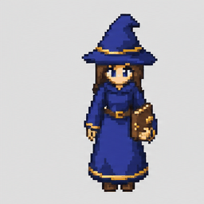 | 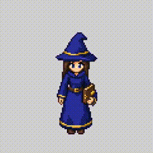 | 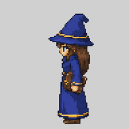 |

*All three animations generated with the pipeline below — same character, same scale, same foot baseline.*

📺 **Watch the full tutorial:** [How I Turn AI Art Into A Playable Game Character](https://www.youtube.com/watch?v=ftWQpHyWcVQ)

📝 **Builds on this article:** [Cass Attack Spritesheet Pipeline](https://x.com/chongdashu/status/2047271308166078951) — the original write-up of this normalization pipeline that the video extends.

🐦 **Follow [@chongdashu](https://x.com/chongdashu) on X** for daily AI gamedev tips, prompts, and experiments.

This repo contains everything you need to follow along:

- `prompts/` — the exact prompt templates, one per pipeline step
- `references/` — the reference images you pass into each prompt (pixel grid, sheet guide, anchors, contact sheets, runtime strips)

---

## Want more like this?

- [**Free Insiders**](https://insiders.aioriented.dev?utm_source=github&utm_medium=readme_more_like_this&utm_campaign=vgd-05) — newsletter + cheat sheets, prompts, and reference images from every video.
- [**VibeGameDev**](https://vibegamedev.com?utm_source=github&utm_medium=readme_more_like_this&utm_campaign=vgd-05) — the `animated-spritesheets` and `gamedev-assets` skills that automate this whole pipeline, plus full source from every project.

---

## The Pipeline

> Image gen ≈ 20% of the work. The other 80% is the pipeline below.

```text
concept / box art direction
  → south-facing game anchor (prompt + grid)
  → neutral south anchor (no baked-in effects)
  → west / north directional anchors  (east = horizontal flip)
  → walk cycles via image-to-video
  → attack spritesheets (5x2)
  → idle spritesheets (5x2)
  → background removal + frame normalization
  → runtime spritesheets ready for game integration
```

| Stage | Output |
|---|---|
| Concept / box art | 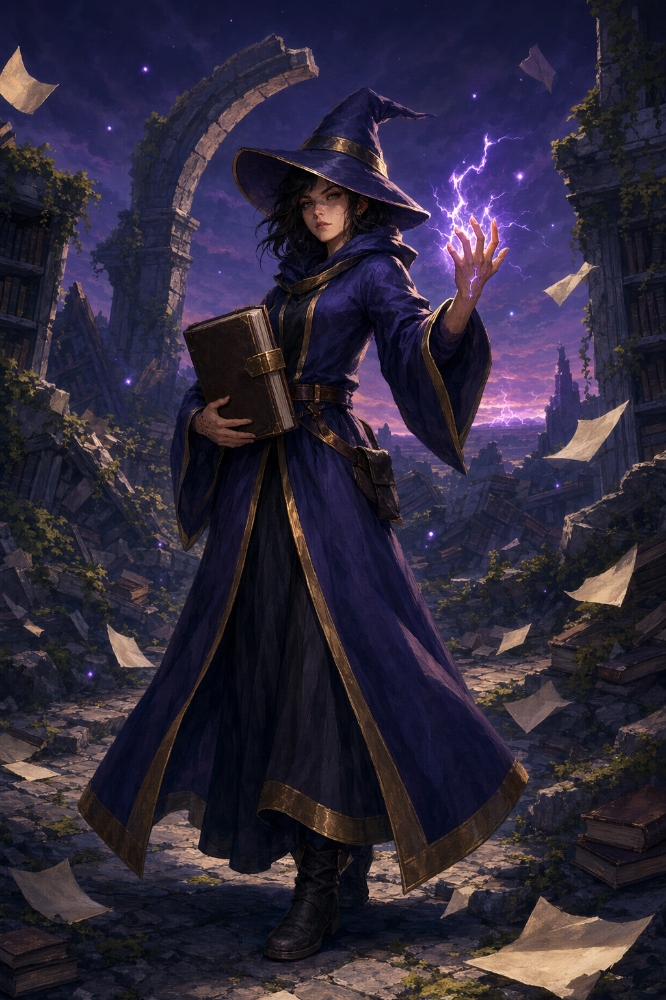 |
| South anchor (prompt + grid) ✅ | 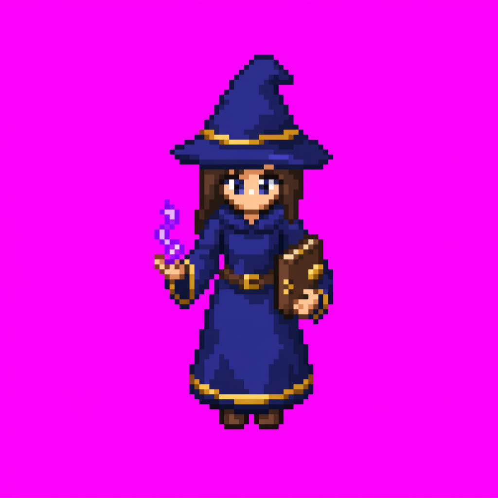 |
| Direct box-art-to-sprite ❌ | 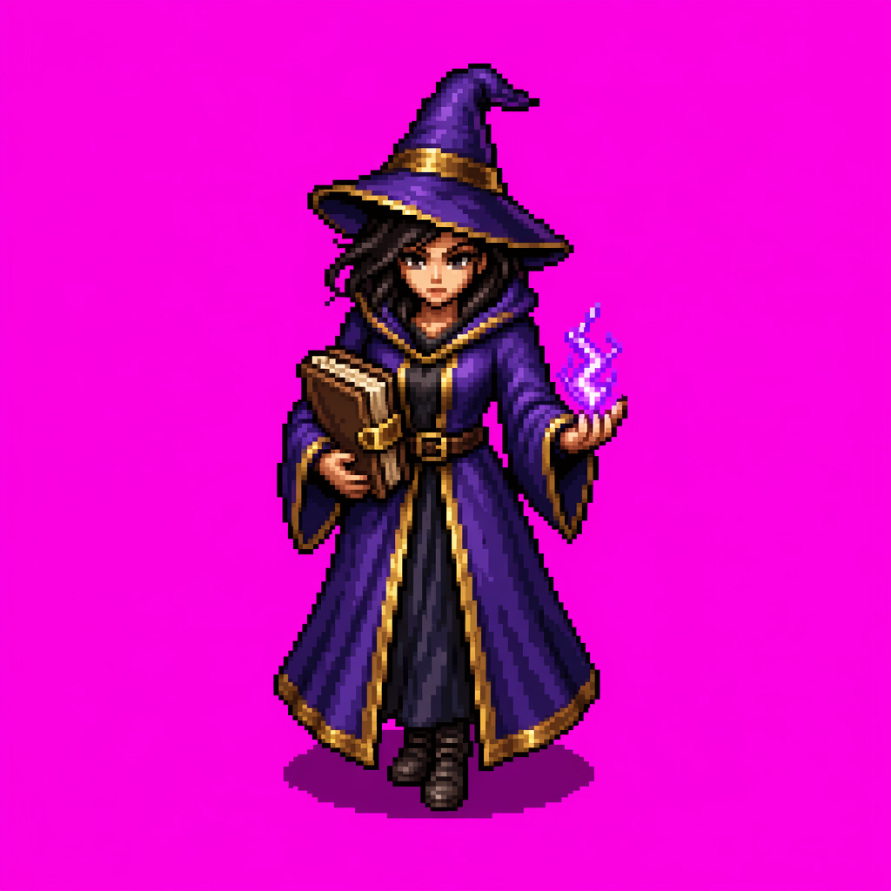 |
| Neutral south anchor (effects stripped) | 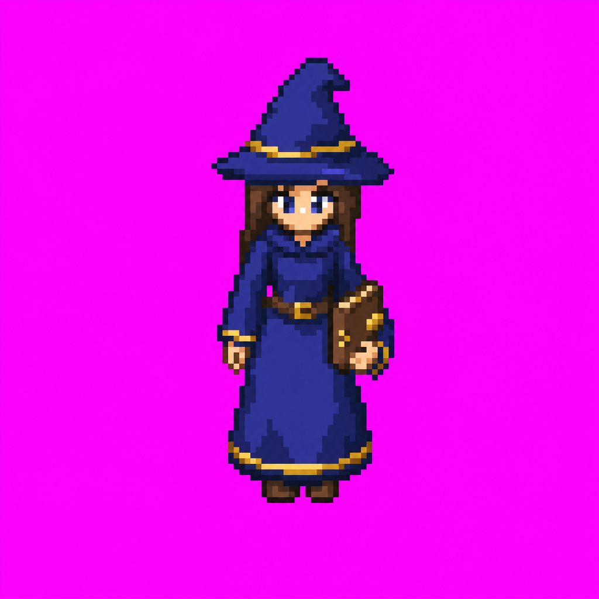 |
| Directional anchors | 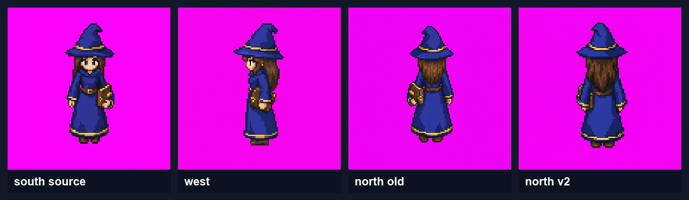 |
| Walk-cycle review (south) | 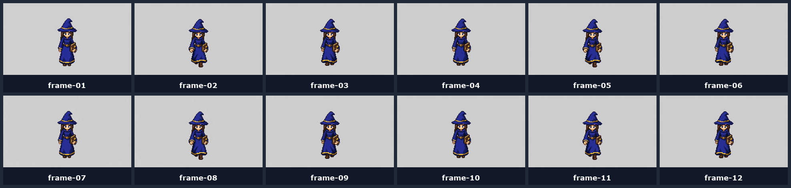 |
| Attack review (south) | 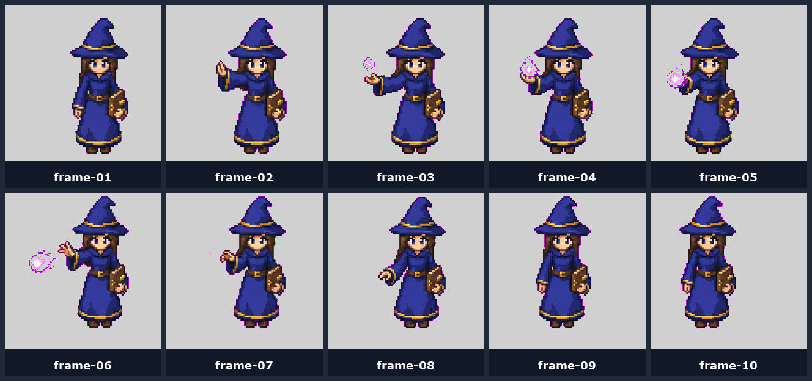 |
| Idle review (south) |  |
| Final runtime walk strip | 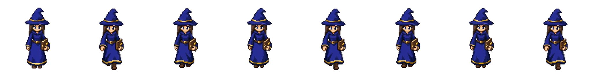 |

---

## Prompt Templates

Step-by-step templates with `{PLACEHOLDERS}` you fill in for your own character:

1. [01 — Box Art](prompts/01-box-art.md) — generate the high-res concept portrait
2. [02 — South Anchor](prompts/02-south-anchor.md) — the most important image you'll generate
3. [03 — Neutral Anchor Reset](prompts/03-neutral-anchor.md) — strip baked-in magic / weapons
4. [04 — Directional Anchors](prompts/04-directional-anchors.md) — west / north (east = flip)
5. [05 — Walk Cycle (image-to-video)](prompts/05-walk-cycle-i2v.md) — the only thing that actually works
6. [06 — Attack Spritesheet](prompts/06-attack-spritesheet.md) — 10-frame 5x2 sheet
7. [07 — Idle Spritesheet](prompts/07-idle-spritesheet.md) — subtle 10-frame loop
8. [08 — Normalization](prompts/08-normalization.md) — the part nobody shows you

---

## The Stack

- **Image generation:** GPT Image 2.0 (anchors, idle, attack)
- **Walk cycles:** [fal.ai](https://fal.ai) → SeedDance 2.0 image-to-video
- **Background removal:** Bria (via fal) or remove.bg
- **Skills (optional, automated pipeline):** animated-spritesheets + gamedev-assets ([VibeGameDev](https://vibegamedev.com?utm_source=github&utm_medium=readme_body_stack&utm_campaign=vgd-05))

---

## What You'll Learn

- Why the south-facing anchor is the most important image you generate
- The neutral-pose rule that saves your walk cycles before you even start animating
- How to use a black-and-white pixel grid to enforce pixel-art discipline
- How to generate idle + attack spritesheets with a 5×2 canvas guide
- The image-to-video walk cycle technique (and why every other approach fails)
- How to pick 8–12 frames from a 90-frame video to build a clean loop
- The normalization pipeline: chroma background, height correction, foot anchoring
- Mixels vs real pixels — why "fake" pixel art is fine for prototyping

---

## License

MIT — see [LICENSE](LICENSE). Use these prompts and references freely in your own projects.

If this helped you:

- ⭐ Star this repo
- 🐦 Follow [@chongdashu](https://x.com/chongdashu) on X for more AI gamedev
- 📺 Subscribe on [YouTube @AIOriented](https://www.youtube.com/@AIOriented)
- 🎮 Check out [VibeGameDev](https://vibegamedev.com?utm_source=github&utm_medium=readme_footer&utm_campaign=vgd-05) for the full automation toolkit
