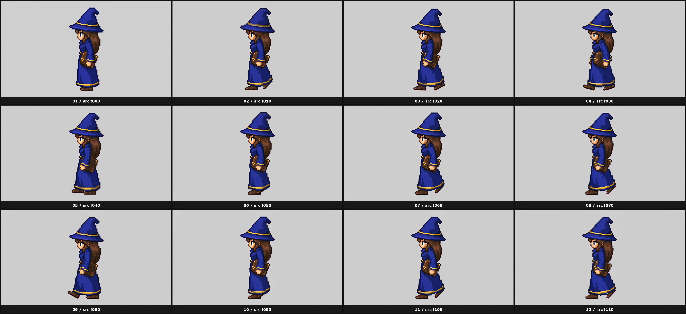
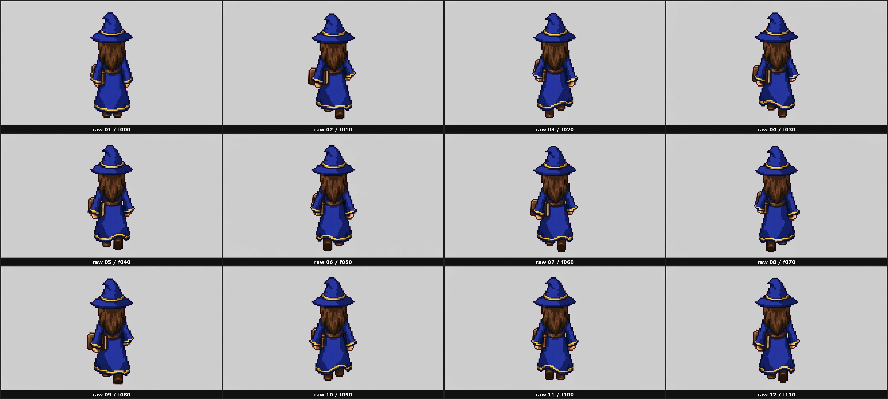

# 05 — Walk Cycle (Image-To-Video)

**You will never get walk cycles right with image generation alone.** Trust me — I tried for a long time. The trick is image-to-video, then frame-pick.


## When to use

- You have all four directional anchors approved
- You need actual walking animation, not poses

## The technique

1. Pass your **directional anchor only** into an image-to-video model
2. Use the prompt below to lock the character in place
3. Get back ~80–120 frames at 4–5s
4. Manually pick 8–12 frames that form one complete walk loop

## Tool

[fal.ai → SeedDance 2.0 image-to-video](https://fal.ai/models/fal-ai/seedance/v2/pro/image-to-video) (or any equivalent i2v model). The shortest available video length is usually ~4 seconds.

## Critical rule

**Do NOT pass any guide canvas or pixel grid as a second input.** It blends into the model's output and you get strange results. One image only.

## Prompt template

```text
Animate this single character into a simple {DIRECTION}-facing in-place walk cycle for a top-down 2D game.

The character must face {DIRECTION_DESCRIPTION} for the entire clip.
Preserve the exact identity, sprite-like pixelated look, proportions, palette, costume, and silhouette from the input image.
Do not turn toward any other direction.
Do not pivot, rotate, or show a quarter-turn view.
Do not change body orientation at any point.

Keep the camera fixed and centered.
Keep the framing unchanged.
Keep the character centered on the same flat neutral background.
Do not turn the background into a floor, room, horizon, outdoor scene, perspective grid, shadow plane, or environment.

Motion:
- low-fidelity, readable, game-sprite reference motion
- small looping in-place walk
- subtle vertical bobbing
- alternating leg steps
- light clothing/equipment sway
- minimal arm swing
- feet remain visible
- character does not translate across the frame

One character only.
No scene.
No extra props.
No labels.
No arrows.
No camera movement.
No zoom.
No attack animation.
No weapon swing.
No magic, fireball, spell effects, smoke, particles, glow, trails, or impacts.
```

## Frame picking

Once you have the video:

1. Scrub through and find the first frame where the character is in a "neutral" stance (both feet roughly together, mid-stride or at apex).
2. Continue scrubbing until you see that exact same pose again — that's one full cycle.
3. Pick 8–12 evenly-spaced frames between those two points.
4. Save them as individual PNGs at the correct frame size (e.g. 256×256).

## Repeat for each direction

Run the i2v step three times: south, west, north. Skip east — it's a horizontal flip of west.

| Direction | Contact sheet |
|---|---|
| South |  |
| West |  |
| North |  |

## Cost note

i2v is the most expensive step in the pipeline. Budget for 3 video runs per character (S, W, N) plus a few re-rolls if the character drifts out of frame.

## Next step

→ [06 — Attack Spritesheet](06-attack-spritesheet.md)
