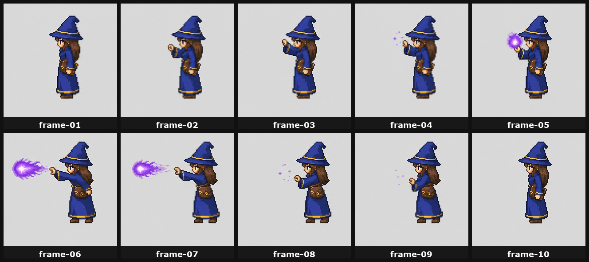
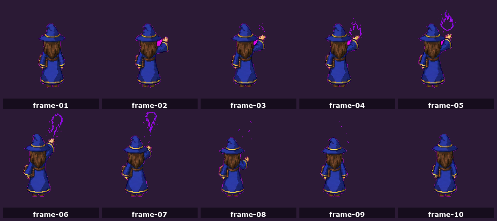

# 06 — Attack Spritesheet

A 10-frame 5×2 attack spritesheet, generated in one shot via GPT Image 2.0. **This is the only place dynamic effects (projectiles, flames, glow) live** — never in your anchors, idle, or walk frames.


## When to use

- You have a directional anchor for this direction
- The character has a defined attack with a clear projectile or effect

## Inputs

- **Image 1** — directional anchor for this direction (identity)
- **Image 2** — 5×2 sheet guide: [`references/grids/sheet-guide-5x2-1280x512.png`](../references/grids/sheet-guide-5x2-1280x512.png)

## Recommended sizes

- `{SHEET_SIZE}` = `1280x512`
- `{CELL_SIZE}` = `256x256`
- 5 columns × 2 rows = 10 frames per direction

## Prompt template

```text
Intended use:
Create a 10-frame 5x2 spritesheet for a top-down 2D game character attack animation.

Input images:
Image 1 is the identity anchor for {CHARACTER_NAME}. Preserve the exact character identity, outfit, proportions, prop placement, silhouette, palette, and {DIRECTION}-facing direction.
Image 2 is the 5x2 spritesheet layout/style guide. Use it only as a layout guide for ten equal cells across a {SHEET_SIZE} sheet.

Primary request:
Generate {CHARACTER_NAME} performing a {DIRECTION}-facing {ATTACK_NAME}. The character faces {DIRECTION_DESCRIPTION} for every frame. The attack effect is dynamic, but the character remains on a stable foot baseline.

Canvas and layout:
- {SHEET_SIZE} PNG spritesheet
- 5 columns by 2 rows
- ten equal {CELL_SIZE} cells
- frame order left to right across top row, then left to right across bottom row
- character fully visible in each cell, including both feet
- consistent character scale, camera, and ground baseline across all frames
- simple solid chroma background if a flat background is needed

Frame sequence:
Frame 1: neutral ready stance, feet planted, no large active effect.
Frame 2: begins the attack, body still facing {DIRECTION}.
Frame 3: anticipation pose, casting/attack hand rises or shifts.
Frame 4: small {EFFECT_COLOR} spark/charge appears.
Frame 5: compact {PROJECTILE_OR_EFFECT} forms, bright but not obscuring body or feet.
Frame 6: release frame, attack launches toward {ATTACK_TRAVEL_DIRECTION}.
Frame 7: follow-through, effect moves farther with a short trail; character recoils slightly.
Frame 8: recoil peak, residual particles fade.
Frame 9: settles back toward neutral, only faint embers remain.
Frame 10: return to calm ready stance, no large active effect.

Style:
- high-resolution pixel-art-inspired game sprite
- clean fantasy/action RPG animation frames
- crisp edges
- consistent lighting and palette
- readable silhouette

Constraints:
- no direction change
- no camera angle change
- no extra characters
- no props beyond existing gear
- no scenery, UI, labels, text, watermark, or visible grid lines
- do not crop feet, hair, props, arms, or effect
- do not merge cells or create comic panels
- do not recenter the character differently per frame
```

## Frame extraction

The model often won't put frames in *exactly* even cells — characters may drift slightly inside their cell. That's fine; you'll fix it in [08 — Normalization](08-normalization.md).

## Run for each direction

| Direction | Contact sheet |
|---|---|
| South |  |
| West |  |
| North |  |

East = horizontal flip of west.

## Wizard example

The wizard's attack uses a purple fireball: violet core, lavender edge glow, small ember particles. South casts forward, north casts away from camera, west casts left.

## Next step

→ [07 — Idle Spritesheet](07-idle-spritesheet.md)
