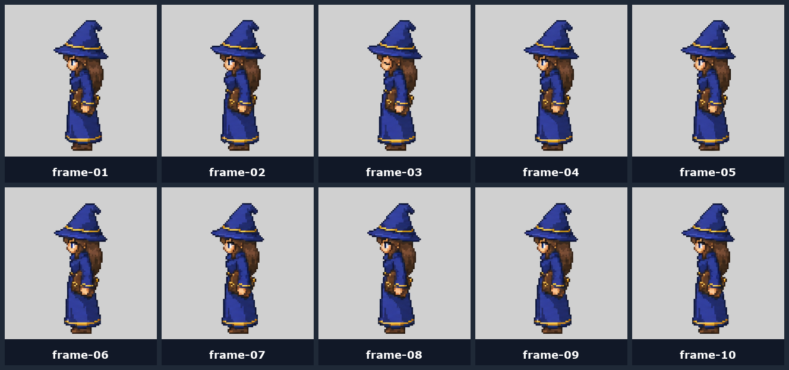
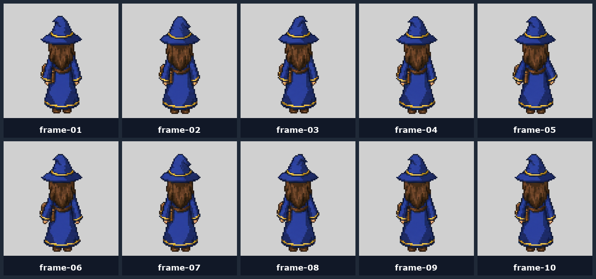

# 07 — Idle Spritesheet

A 10-frame 5×2 subtle idle loop. Same format as the attack sheet, but **no effects, no walking step, no turning** — just breath and cloth sway.


## Inputs

- **Image 1** — directional anchor for this direction (identity)
- **Image 2** — 5×2 sheet guide: [`references/grids/sheet-guide-5x2-1280x512.png`](../references/grids/sheet-guide-5x2-1280x512.png)

## Prompt template

```text
Intended use:
{DIRECTION}-facing idle animation spritesheet for a top-down 2D game character.

Input images:
Image 1 is the approved {DIRECTION}-facing identity anchor. Preserve the exact character identity, proportions, direction, palette, outfit, accessories, and high-resolution pixelated game-sprite style.
Image 2 is the 5 columns x 2 rows sheet guide. Use it only as a spritesheet layout and pixel-texture guide.

Primary request:
Create a single {SHEET_SIZE} spritesheet with 10 frames arranged 5 columns x 2 rows. The character faces {DIRECTION_DESCRIPTION} in every frame and performs a subtle idle loop.

Frame sequence:
Frame 1: neutral relaxed stance.
Frame 2: slight inhale, shoulders/robe rise by a few pixels.
Frame 3: hat/hair/cloth settles with tiny sway.
Frame 4: tiny facial/cloth movement while body stays grounded.
Frame 5: slight exhale, robe lowers.
Frame 6: subtle hand/accessory sway.
Frame 7: return toward neutral.
Frame 8: tiny cloth sway in opposite direction.
Frame 9: settle.
Frame 10: match frame 1 closely for a clean loop.

Composition constraints:
- one full-body character per frame
- feet, robe/hem, head/hat, sleeves, hands, and accessories fully visible
- consistent character size
- consistent foot baseline
- consistent center position

Critical constraints:
- no attack effect
- no glow, particles, fireball, projectile, or aura
- no walking step
- no turning
- no added props, UI, labels, frame numbers, shadows, or scene detail

Style:
- high-resolution pixelated 2D game sprite
- crisp readable silhouette
- opaque flat background
```

## Loop seam

Frame 10 must match frame 1 closely. If the model drifts, you'll see a visible jump every cycle. Re-roll if the seam is bad.

## Run for each direction

| Direction | Contact sheet |
|---|---|
| South |  |
| West |  |
| North |  |

East = horizontal flip of west.

## Next step

→ [08 — Normalization](08-normalization.md) (this is the part nobody shows you)
