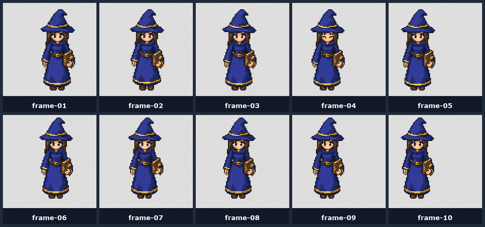
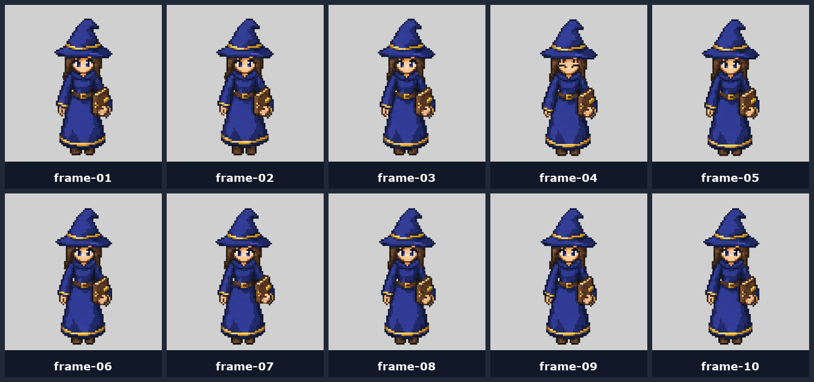
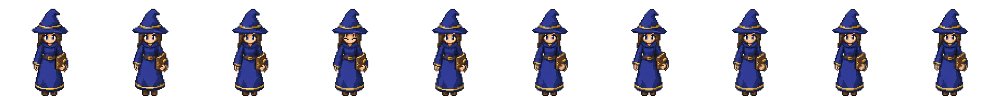
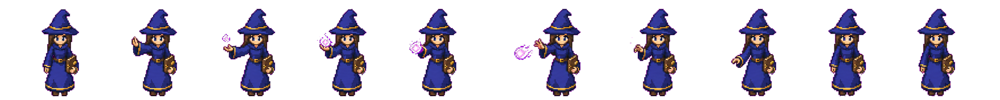

# 08 — Normalization (The Part Nobody Shows You)

Raw image-gen outputs are **not** game assets. They're inconsistent in scale, position, and background. The pipeline below is what turns them into something you can drop into a game.

| ❌ Raw cells: drift visible | ✅ Normalized: stable anchor |
|---|---|
|  |  |

## Why it matters

The character drifts inside each nominal cell. If you load drifted frames into your game directly, the character appears to bob and shift around even during idle. Foot position changes between frames, attacks look smaller than idle, and the whole thing feels broken.

## The 7 steps

### 1. Recover frames

Split the spritesheet into individual frames. **Don't trust the nominal grid** — measure where the character actually is (alpha bounding box) and crop based on that.

### 2. Remove the background

Real alpha channel, not just "looks transparent." Options:

- [Bria background remove](https://fal.ai/models/fal-ai/bria/background/remove) (via fal.ai) — works well on flat-chroma sources
- [remove.bg](https://www.remove.bg/) — solid general-purpose API
- Manual chroma key in any image editor (works because we requested `#FF00FF` or `#00FF00` in earlier prompts)

### 3. Measure each foreground

For every frame, find:

- visible width
- visible height
- center X
- foot baseline (bottom Y of opaque pixels)

### 4. Correct height/scale

Compare against your approved idle or walk sheet. If the attack frames came back smaller (common!), scale them up so the character's visible height matches.

### 5. Re-pad to fixed canvas

Paste each scaled frame onto a fresh `256×256` (or whatever your runtime cell size is) canvas with:

- consistent `center_x`
- consistent foot `bottom_y`

This locks the character in place across all frames of all animations.

### 6. Rebuild the atlas

Pack the normalized frames back into a spritesheet — same grid, same frame count, same animation order.

### 7. Verify

- Generate a contact sheet (every frame side by side)
- Generate a GIF preview at the actual frame size
- Visually confirm: no drift, no scale jump between idle/walk/attack
- Only then update your asset manifest and integrate

## Final result

| Idle | Walk | Attack |
|---|---|---|
|  |  |  |

All three at the same scale, same foot baseline, same canvas size. Drop-in ready.

## Process pseudocode

```text
Before promoting an animation to your game's assets:
1. Split/recover frames into exact cells (using alpha bounds, not nominal grid).
2. Remove background (Bria / remove.bg / chroma key).
3. Compare alpha bounds against this character's approved idle/walk sheets.
4. Normalize visible body scale and foot baseline inside each cell.
5. Preserve atlas dimensions and frame count.
6. Create contact sheet and GIF preview using the real frame size.
7. Only then integrate into game code.
```

## Want this automated?

This is the step that takes the longest manually. The **animated-spritesheets** + **gamedev-assets** skills inside [VibeGameDev](https://vibegamedev.com?utm_source=github&utm_medium=prompt_normalization&utm_campaign=vgd-05) automate the entire normalization pipeline end-to-end — single prompt in, normalized game-ready spritesheets out.

## You're done

You now have idle + walk + attack spritesheets in all four directions, normalized, background-removed, ready to integrate.

Drop them into your game's asset directory, register them in your loader, and they're playable.
